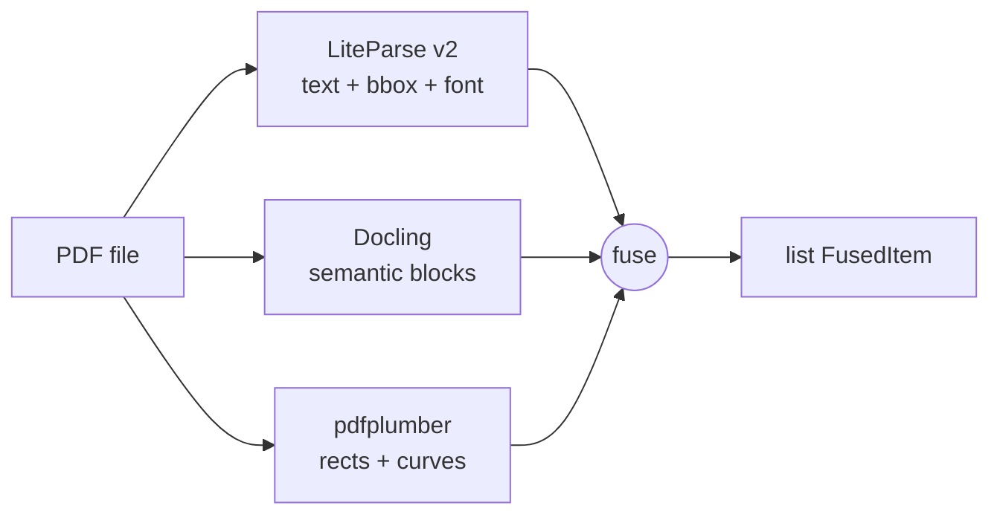

# Docomestria

[](https://pypi.org/project/docomestria/)
[](https://pypi.org/project/docomestria/)
[](LICENSE)
[](https://github.com/MrGo2/docomestria/actions/workflows/tests.yml)

Fuse [LiteParse v2](https://pypi.org/project/liteparse/), [Docling](https://pypi.org/project/docling/), and [pdfplumber](https://pypi.org/project/pdfplumber/) into a single enriched PDF extraction. Each text item is tagged with its font metadata, its semantic role (`section_header`, `list_item`, `table`, ...), and the visual box that encloses it on the page.

## Install

```bash
pip install docomestria             # core
pip install docomestria[llm]        # + LLM provenance binding
pip install docomestria[transform]  # + typed value extraction
pip install docomestria[llm,transform]
```

## Usage

```python
from docomestria import fuse

result = fuse("contract.pdf")
for item in result.items:
    print(item.section_title, "->", item.text)
```

> Breaking change in v0.3.0 — `fuse()` now returns a `FusionResult`. If you
> upgraded from v0.2.0, use `fuse(pdf).items` to recover the old list shape.

Each returned `FusedItem` carries:

- the original text and bounding box
- font name and size (from LiteParse)
- semantic label and heading level (from Docling)
- the enclosing visual box and its inferred section title (from pdfplumber)

## Why fusion?

No single PDF engine sees the whole picture. Docomestria stitches their views together.

| Capability                         | LiteParse | Docling | pdfplumber |
|------------------------------------|:---------:|:-------:|:----------:|
| Byte-perfect text per item         |    yes    |    -    |     -      |
| Font name and size per item        |    yes    |    -    |     -      |
| Semantic labels (header, list...)  |     -     |   yes   |     -      |
| Heading hierarchy                  |     -     |   yes   |     -      |
| Visual rectangles and lines        |     -     |    -    |    yes     |
| Checkbox detection                 |     -     |    -    |    yes     |

The combined output answers questions none of the engines can answer alone, such as: *"this list item lives inside the box titled DATOS PERSONALES DEL TITULAR and is rendered in Arial-Bold 12pt."*

## Typed extraction (optional)

Convert raw strings to typed Python values (dates, `Decimal`, `Money`, IBAN,
NIF, ...) while keeping the bbox and page provenance attached:

```python
from docomestria import fuse
from docomestria.llm import bind_provenance
from docomestria.transform import Schema, Field, transformers as tr

result = fuse("contract.pdf")
llm_output = {"nif": "51789286W", "fecha": "06 de Diciembre", "importe": "1.234,56 EUR"}

bound = bind_provenance(llm_output, result.items)

schema = Schema({
    "nif":     Field(tr.nif_es, required=True),
    "fecha":   Field(tr.date_es_long),
    "importe": Field(tr.amount_eur),
})

typed = schema.apply(bound, result)
nif = typed["nif"]
print(nif.normalized, nif.confidence, nif.issues)
print("bbox:", nif.bbox, "page:", nif.page)

trace = nif.trace(result)
print("section:", " > ".join(trace.chains[0].section_path))
```

Install: `pip install docomestria[transform,llm]`.

## LLM provenance (optional)

Bind LLM-extracted outputs back to their source in the PDF and detect hallucinations:

```python
from docomestria import fuse
from docomestria.llm import bind_provenance, detect_hallucinations

items = fuse("contract.pdf")
llm_output = {"nif": "51789286W", "name": "Claudio Alejandro"}

bound = bind_provenance(llm_output, items)
issues = detect_hallucinations(bound)
```

Install: `pip install docomestria[llm]`

Works with any LLM (Gemini, Claude, OpenAI, local) — pass any JSON dict.

## Architecture



For each LiteParse text item, `fuse()`:

1. finds the smallest containing Docling block (centroid first, IoU fallback);
2. finds the smallest containing pdfplumber rectangle and records its id;
3. picks the largest-font item inside each enclosing box as the box title.

See [docs/architecture.md](docs/architecture.md) and [docs/why-fusion.md](docs/why-fusion.md) for the rationale.

## Examples

See [examples/](examples/) for runnable scripts.

## Contributing

Pull requests are welcome. See [CONTRIBUTING.md](CONTRIBUTING.md) for development setup, coding rules, and how to run the test suite.

## License

MIT. See [LICENSE](LICENSE).
