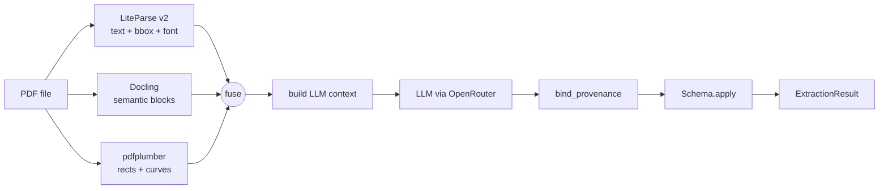

# Docomestria

[](https://pypi.org/project/docomestria/)
[](https://pypi.org/project/docomestria/)
[](LICENSE)
[](https://github.com/MrGo2/docomestria/actions/workflows/tests.yml)

Fuse [LiteParse v2](https://pypi.org/project/liteparse/), [Docling](https://pypi.org/project/docling/), and [pdfplumber](https://pypi.org/project/pdfplumber/) into a single enriched PDF extraction. Then route the result through your favorite LLM, bind the output back to bounding boxes, and type the values — all from one `Pipeline.run(pdf)` call.

## Install

```bash
pip install docomestria[openrouter,transform,llm,pipeline]   # recommended default
pip install docomestria                                       # core only
pip install docomestria[gemini]                               # native Gemini
pip install docomestria[claude]                               # native Anthropic
pip install docomestria[openai]                               # native OpenAI
```

## Quickstart: deterministic mode (no LLM)

For structured forms with clear labels, you don't need an LLM at all:

```python
from docomestria import Pipeline
from docomestria.transform import Schema, Field, transformers as tr

schema = Schema({
    "nif": Field(tr.nif_es, labels=("NIF", "DNI")),
    "cp":  Field(tr.postal_code_es, labels=("C.P.",)),
})

pipe = Pipeline(schema=schema, llm=None)   # no LLM
result = pipe.run("form.pdf")              # free, ~1-3 seconds
```

For free-text contracts or unstructured PDFs, use the [OpenRouter quickstart](#quickstart-with-openrouter) below.

### Mode comparison

| Mode          | LLM needed | Cost                       | Speed   | Best for                                       |
|---------------|------------|----------------------------|---------|------------------------------------------------|
| Deterministic | No         | $0                         | ~1-3s   | Structured forms with labels                   |
| AI-assisted   | Yes        | ~$0.0001-0.001 / PDF       | ~3-8s   | Free-text, unstructured docs, ambiguous fields |

## Quickstart with OpenRouter

OpenRouter gives you one API key for 200+ models, built-in fallback chains, and accurate per-call cost reporting. It is the recommended default for new projects.

```python
import os
from docomestria.pipeline import Pipeline
from docomestria.pipeline.providers import OpenRouter
from docomestria.transform import Schema, Field, transformers as tr

schema = Schema({
    "nif":            Field(tr.nif_es),
    "fecha_contrato": Field(tr.date_es_long),
})

llm = OpenRouter(
    api_key=os.environ["OPENROUTER_API_KEY"],
    models=(
        "google/gemini-2.5-flash-lite",   # cheapest, primary
        "anthropic/claude-haiku-4.5",     # fallback if Google fails
    ),
    route="fallback",
)

pipe = Pipeline(schema=schema, llm=llm)
extraction = pipe.run("contract.pdf")

print(extraction.typed_fields["nif"].normalized)
print(f"cost: ${extraction.cost.usd:.6f}  model: {extraction.cost.model_used}")
```

See [examples/openrouter_pipeline.py](examples/openrouter_pipeline.py) for a full end-to-end run.

### Streaming API (for UIs and telemetry)

Iterate the pipeline step by step. Each `PipelineStep` carries explanation text (ES/EN), elapsed time, the bboxes produced, and partial state (`fusion`, `bound`, `issues`, `typed_fields` as they become available).

```python
for step in pipe.stream("contract.pdf"):
    print(f"[{step.step_index}/{step.total_steps}] {step.title}  {step.elapsed_ms} ms")
```

Prefer a callback over iteration? Pass `step_callback=...` to the `Pipeline` constructor; it fires for every step in both `run()` and `stream()`.

This is the API consumed by `docomestria-studio`, an interactive visual viewer for non-technical users.

### Why OpenRouter as the default?

| Concern               | OpenRouter                             | Native provider SDKs                |
|-----------------------|----------------------------------------|-------------------------------------|
| API keys to manage    | One                                    | One per vendor                      |
| Model switching       | Change a string                        | Swap SDK + rewrite call             |
| Fallback chains       | Built in                               | Build it yourself                   |
| Cost reporting        | Actual cost in each response           | Estimated from a local price table  |
| Latency               | Slightly higher (extra hop)            | Direct                              |
| Vendor-only features  | Limited                                | Full (Claude prompt cache, etc.)    |

Verified model IDs at release time:
- `google/gemini-2.5-flash-lite` — $0.10/M in, $0.40/M out (cheapest)
- `anthropic/claude-haiku-4.5` — $1/M in, $5/M out
- `openai/gpt-5-nano` — $0.05/M in, $0.40/M out
- `openai/gpt-5-mini` — $0.25/M in, $2/M out

## Native providers (alternatives)

Prefer a direct SDK? All three return the same `LLMResponse` and slot into `Pipeline`.

```python
from docomestria.pipeline.providers import GeminiFlashLite, Claude, OpenAINative

llm = GeminiFlashLite(api_key=os.environ["GEMINI_API_KEY"])
# or
llm = Claude(api_key=os.environ["ANTHROPIC_API_KEY"])
# or
llm = OpenAINative(api_key=os.environ["OPENAI_API_KEY"])
```

See [docs/providers.md](docs/providers.md) for a full comparison.

## What you get back

`Pipeline.run()` returns an `ExtractionResult` with:

- `typed_fields: dict[str, TypedValue]` — normalized typed values with bbox + page provenance
- `issues: tuple[ProvenanceIssue, ...]` — hallucinations and role mismatches detected
- `fusion: FusionResult` — the underlying three-engine fused view
- `bound: tuple[BoundValue, ...]` — LLM outputs bound back to FusedItems
- `cost: CostReport` — tokens in/out plus actual USD
- `duration_ms`, `cache_hit`, `llm_calls`

Call `extraction.trace(field_key)` for the full chain from typed value down to LiteItem + DoclingBlock + VisualRect + table cell.

## Why fusion?

No single PDF engine sees the whole picture. Docomestria stitches their views together.

| Capability                         | LiteParse | Docling | pdfplumber |
|------------------------------------|:---------:|:-------:|:----------:|
| Byte-perfect text per item         |    yes    |    -    |     -      |
| Font name and size per item        |    yes    |    -    |     -      |
| Semantic labels (header, list...)  |     -     |   yes   |     -      |
| Heading hierarchy                  |     -     |   yes   |     -      |
| Visual rectangles and lines        |     -     |    -    |    yes     |
| Checkbox detection                 |     -     |    -    |    yes     |

The combined output answers questions none of the engines can answer alone, such as: *"this list item lives inside the box titled DATOS PERSONALES DEL TITULAR and is rendered in Arial-Bold 12pt."*

## Lower-level building blocks

If you want only fusion (no LLM), use `fuse()` directly:

```python
from docomestria import fuse

result = fuse("contract.pdf")
for item in result.items:
    print(item.section_title, "->", item.text)
```

For typed extraction without the orchestrator, use the layers manually — `bind_provenance` + `Schema.apply`. See [docs/architecture.md](docs/architecture.md).

## Architecture



See [docs/architecture.md](docs/architecture.md), [docs/providers.md](docs/providers.md), and [docs/why-fusion.md](docs/why-fusion.md).

## Examples

See [examples/](examples/) for runnable scripts.

## Contributing

Pull requests are welcome. See [CONTRIBUTING.md](CONTRIBUTING.md) for development setup, coding rules, and how to run the test suite.

## License

MIT. See [LICENSE](LICENSE).
