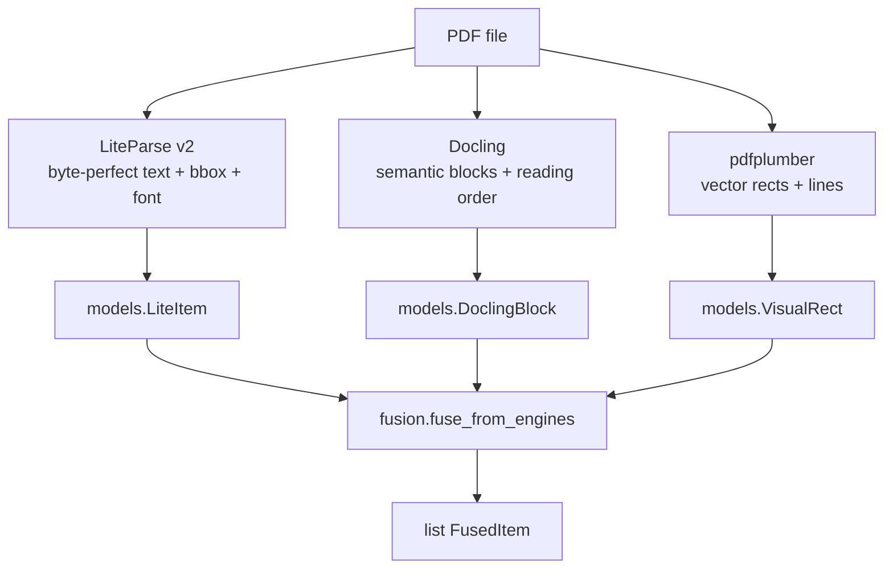
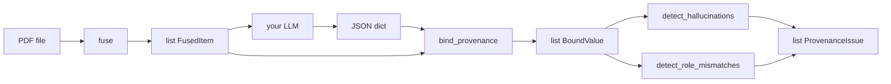
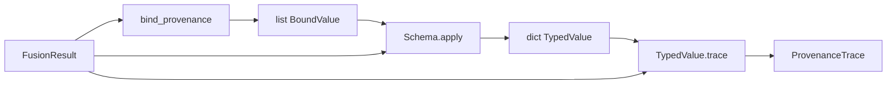

# Architecture

Docomestria is a thin orchestration layer over three independent PDF engines.
It does not parse PDFs itself.

## Data flow

## Coordinate system

All bounding boxes are normalized to **top-left origin** (y grows downward),
matching what LiteParse and pdfplumber report natively. Docling's
bottom-left coordinates are flipped via `to_top_left_origin(page_height=...)`
inside the engine wrapper.

## Matching rules

For each `LiteItem`:

1. **Docling block** — pick the smallest block whose bbox contains the item's
   centroid. If none, fall back to the highest IoU > 0. If still none,
   `docling_label = None`.
2. **Enclosing visual box** — pick the smallest non-checkbox `VisualRect`
   containing the centroid.
3. **Section title** — for each enclosing box, the largest-font item (ties
   broken by topmost position) becomes the box title; the title item itself
   is not tagged with its own title.

Smallest-first matching prevents page-spanning blocks from absorbing every
item. Checkbox-sized rectangles are excluded from the enclosing-box search
because they would otherwise always win.

## Module map

| Module        | Responsibility                                              |
|---------------|-------------------------------------------------------------|
| `geometry`    | Pure functions: area, centroid, IoU, containment.           |
| `models`      | Frozen dataclasses for inputs and `FusedItem`.              |
| `engines/*`   | Thin wrappers that turn PDF bytes into the model types.     |
| `fusion`      | The `fuse()` and `fuse_from_engines()` entry points.        |
| `pairing`     | Optional helper for form-style label-to-value pairing.      |

## Extensibility

`fuse_from_engines()` takes raw model lists, so any engine that emits the
shape of `LiteItem`, `DoclingBlock`, or `VisualRect` can be plugged in without
modifying the fusion code.

## LLM provenance layer (optional)

The `docomestria.llm` sub-package closes the loop between an LLM's extracted
output and the original PDF. It does not call any LLM — it only consumes the
JSON they produce.

For each scalar in the LLM output, `bind_provenance` searches the FusedItems
in three tiers: exact match, substring match, fuzzy match (`rapidfuzz`,
default threshold `0.85`). The result is a `BoundValue` carrying the source
item indices, the union bbox, the inferred section title, and the docling
label at the bound centroid.

`detect_hallucinations` flags values that could not be matched (or that
matched with a score below `require_score`). `detect_role_mismatches` flags
values bound to semantic blocks that are unlikely to hold data, such as
`section_header`, `title`, `page_header`, `page_footer`, or `picture`.

The layer is LLM-agnostic — Gemini, Claude, OpenAI, or local models all work
as long as they return JSON. Install with `pip install docomestria[llm]`.

## Typed extraction layer (optional)

The `docomestria.transform` sub-package turns `BoundValue`s into `TypedValue`s
while preserving the original bbox, page, and source-item provenance.

A `TypedValue` carries:

- `normalized` — the typed payload (e.g. a `date`, `Decimal`, `Money`, `bool`)
- `raw` — the original string the LLM produced
- `bbox`, `page`, `source_items` — copied verbatim from the `BoundValue`
- `confidence` — combined `match_score * transform_score`
- `issues` — typed flags such as `nif_checksum_mismatch`, `invalid_date`,
  `currency_ambiguous`, `required_field_missing`

Transformers are pure functions: `(raw, *, context) -> (normalized, score,
issues)`. The optional `TransformContext` carries the upstream `BoundValue`
and the full `FusionResult`, which is what lets checkbox transformers read
`VisualRect.is_filled`.

## Provenance traceability

`TypedValue.trace(fusion_result)` returns a `ProvenanceTrace` whose `chains`
walk every source `FusedItem` back to:

- the `LiteItem`s that produced the text (font name and size are recoverable),
- the `DoclingBlock` whose semantics matched (e.g. `list_item`, `table_cell`),
- the enclosing `VisualRect`,
- the `TableCellRef` when the item lives in a detected table (with row/column
  headers materialized from the table's first row and column),
- a `section_path` that walks up nested boxes.

This makes "show me the exact pixels and font that produced this typed
value" a one-liner.
